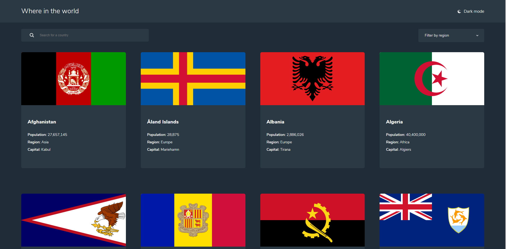

# Frontend Mentor - REST Countries API with color theme switcher solution

This is a solution to the [REST Countries API with color theme switcher challenge on Frontend Mentor](https://www.frontendmentor.io/challenges/rest-countries-api-with-color-theme-switcher-5cacc469fec04111f7b848ca). Frontend Mentor challenges help you improve your coding skills by building realistic projects.

## Table of contents

- [Overview](#overview)
  - [The challenge](#the-challenge)
  - [Screenshot](#screenshot)
  - [Links](#links)
- [My process](#my-process)
  - [Built with](#built-with)
  - [What I learned](#what-i-learned)
  - [Continued development](#continued-development)
- [Author](#author)

## Overview

### The challenge

Users should be able to:

- See all countries from the API on the homepage
- Search for a country using an `input` field
- Filter countries by region
- Click on a country to see more detailed information on a separate page
- Click through to the border countries on the detail page
- Toggle the color scheme between light and dark mode _(optional)_

### Screenshot

### Links

- Solution URL: [Add solution URL here](https://your-solution-url.com)
- Live Site URL: [Add live site URL here](https://your-live-site-url.com)

## My process

### Built with

- Semantic HTML5 markup
- Flexbox
- CSS Grid
- Mobile-first workflow
- [VueJs](https://vuejs.org/) - JS library
- [Axios](https://github.com/axios/axios) - JS library for request
- [SCSS](https://sass-lang.com/) - For styles

### What I learned

Throughout this project I learned how to create a web page in Vue js. It's been a while since I wanted to try Vue so this was the best opportunity for me

### Continued development

I would like to use Vue js again but this time add a router like vue router, I think it could be really helpfull in the future

## Author

- Website - [Atndesign](https://atndesign.github.io/portfollio/)
- Frontend Mentor - [@Atndesign](https://www.frontendmentor.io/profile/atndesign)
